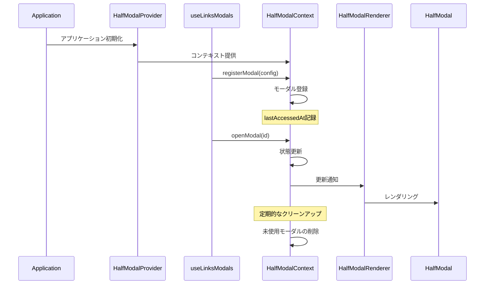

# HalfModal Documentation

## 概要

HalfModalは、画面下部から表示されるモーダルUIコンポーネントです。アプリケーション全体で統一されたモーダル体験を提供します。メモリ管理と自動クリーンアップ機能を備えています。

## アーキテクチャ

### コンポーネント構成

```plaintext
half-modal/
├── constants.ts          # 定数定義
├── types/               # 型定義
│   ├── modal.ts         # モーダル基本型
│   ├── context.ts       # コンテキスト型
│   ├── props.ts         # プロパティ型
│   └── index.ts         # 型定義のエクスポート
├── utils/               # ユーティリティ
│   ├── cleanup.ts       # クリーンアップロジック
│   ├── monitoring.ts    # メモリ監視
│   └── operations.ts    # モーダル操作
├── HalfModal.tsx        # モーダルの基本UIコンポーネント
├── HalfModalContext.tsx # モーダル状態管理のコンテキスト
└── HalfModalRenderer.tsx # 登録されたモーダルのレンダリング
```

### モジュールの責務

#### 定数 (`constants.ts`)

- クリーンアップ間隔
- 最大モーダル数
- タイムアウト時間

#### 型定義 (`types/`)

- `modal.ts`: モーダルの基本型定義
- `context.ts`: コンテキストの型定義
- `props.ts`: プロパティの型定義
- `index.ts`: 型定義のエクスポート

#### ユーティリティ (`utils/`)

- `cleanup.ts`: モーダルのクリーンアップロジック
- `monitoring.ts`: メモリ使用量の監視
- `operations.ts`: モーダル操作（登録、解除、開閉）

### プロバイダー構成

機能ごとのモーダルは、それぞれ独立したコンテキストとして管理することができます。

```plaintext
feature/links/
└── application/
    └── context/
        ├── ModalProvider.tsx          # 機能全体のモーダル管理
        ├── LinkInputModalContext.tsx  # リンク入力モーダル用コンテキスト
        └── LinkActionModalContext.tsx # リンクアクション用コンテキスト
```

### プロバイダーの構成例

```tsx
// ModalProvider.tsx
export const ModalProvider = ({ children }: ModalProviderProps) => {
  return (
    <LinkInputModalProvider>
      <LinkActionModalProvider>{children}</LinkActionModalProvider>
    </LinkInputModalProvider>
  );
};
```

この構成により：

- 各モーダルの状態を独立して管理
- 関心の分離を実現
- モーダル間の依存関係を明確化

### プロバイダーの使用方法

```tsx
// App.tsx または機能のルートコンポーネント
import { ModalProvider } from "@/feature/links/application/context/ModalProvider";

export const LinksFeature = () => {
  return (
    <ModalProvider>
      <YourFeatureComponents />
    </ModalProvider>
  );
};
```

### 基本シーケンス図



## メモリ管理

### 自動クリーンアップ

クリーンアップは`cleanup.ts`で一元管理されています：

```typescript
// constants.ts
export const CLEANUP_INTERVAL = 5 * 60 * 1000; // 5分
export const MODAL_TIMEOUT = 10 * 60 * 1000; // 10分
export const MAX_MODAL_COUNT = 10;

// cleanup.ts
export const shouldCleanupModal = (
  modal: HalfModalConfig,
  now: number = Date.now(),
): boolean => {
  if (modal.isOpen) return false;
  if (modal.lastAccessedAt && now - modal.lastAccessedAt < MODAL_TIMEOUT)
    return false;
  return true;
};
```

### メモリ監視

メモリ監視は`monitoring.ts`で実装されています：

```typescript
// monitoring.ts
export const monitorModalCount = (
  currentSize: number,
  previousMax: number,
): number => {
  if (currentSize > previousMax) {
    if (currentSize > MAX_MODAL_COUNT) {
      console.warn(
        `Warning: Large number of modals registered (${currentSize})`,
      );
    }
    return currentSize;
  }
  return previousMax;
};
```

## モジュール構成の詳細

### 型定義システム

型定義は`types/`ディレクトリで管理され、以下の構造を持ちます：

```typescript
// types/modal.ts - 基本型定義
export interface HalfModalProps {
  onClose: () => void;
}

// types/context.ts - コンテキスト関連の型
export interface HalfModalContextType {
  modals: Map<string, HalfModalConfig>;
  registerModal: (
    config: Omit<HalfModalConfig, "isOpen" | "lastAccessedAt">,
  ) => void;
  // ...
}

// types/props.ts - プロパティ型
export interface HalfModalProviderProps {
  children: ReactNode;
}

// types/index.ts - 一括エクスポート
export * from "./modal";
export * from "./context";
export * from "./props";
```

### ユーティリティ関数

#### モーダル操作 (`operations.ts`)

```typescript
// モーダルの登録
export const registerModal = (
  prev: Map<string, HalfModalConfig>,
  config: Omit<HalfModalConfig, "isOpen" | "lastAccessedAt">,
): Map<string, HalfModalConfig> => {
  return new Map(prev).set(config.id, {
    ...config,
    isOpen: false,
    lastAccessedAt: Date.now(),
  });
};

// その他の操作関数も同様のパターンで実装
```

## 実装例

### Links機能での実装例

```typescript
// feature/links/application/hooks/link/useLinksModals.ts
type ModalViews = Partial<{
  LinkInputView: React.ComponentType<HalfModalProps>;
  LinkActionView: React.ComponentType<HalfModalProps>;
}>;

export const useLinksModals = (views: ModalViews = {}) => {
  const { registerModal, unregisterModal, openModal, closeModal } =
    useHalfModal();
  const registeredModals = useRef<Set<ModalId>>(new Set());

  // モーダル登録ロジック
  const registerModalIfNeeded = useCallback(
    (id: ModalId) => {
      if (registeredModals.current.has(id)) return;
      const component =
        id === MODAL_IDS.LINK_INPUT
          ? views.LinkInputView
          : views.LinkActionView;
      // ... 登録処理
    },
    [registerModal, closeModal, views],
  );

  // クリーンアップ
  useEffect(() => {
    const modalsRef = registeredModals.current;
    return () => {
      modalsRef.forEach((id) => unregisterModal(id));
      modalsRef.clear();
    };
  }, [unregisterModal]);

  return {
    openLinkInput: views.LinkInputView ? openLinkInput : noop,
    closeLinkInput: views.LinkInputView
      ? () => closeModal(MODAL_IDS.LINK_INPUT)
      : noop,
    // ...
  };
};
```

### モーダルビューの実装例

```typescript
// feature/links/presentation/views/LinkActionView.tsx
export const LinkActionView = memo(function LinkActionView({
  onClose,
}: HalfModalProps) {
  const handleAction = useCallback(() => {
    // アクション実行
    onClose();
  }, [onClose]);

  return (
    <View>
      <Button onPress={handleAction} />
    </View>
  );
});
```

## パフォーマンス最適化

### メモ化戦略

1. **コンポーネントのメモ化**

```typescript
export const ModalView = memo(function ModalView({ onClose }: HalfModalProps) {
  // 実装
});
```

2. **コールバックのメモ化**

```typescript
const handleAction = useCallback(
  () => {
    // アクション実行
  },
  [
    /* 依存配列 */
  ],
);
```

3. **値のメモ化**

```typescript
const memoizedValue = useMemo(
  () => {
    // 計算処理
  },
  [
    /* 依存配列 */
  ],
);
```

### レンダリング最適化

1. **条件付きレンダリング**

```typescript
{shouldRender && <ModalContent />}
```

2. **遅延ローディング**

```typescript
const ModalComponent = lazy(() => import("./ModalComponent"));
```

## デバッグとトラブルシューティング

### 一般的な問題と解決策

1. **モーダルが表示されない**

   - モーダルIDの確認
   - 登録状態の確認
   - コンポーネントの存在確認

2. **メモリリーク**

   - クリーンアップ関数の実装確認
   - 未使用モーダルの監視
   - 登録解除の確認

3. **パフォーマンス問題**
   - 不要な再レンダリングの特定
   - メモ化の適用
   - コンポーネント分割の検討

## 今後の展開

1. **機能拡張**

   - アニメーション設定のカスタマイズ
   - モーダルスタック管理
   - 状態永続化オプション

2. **パフォーマンス改善**

   - レンダリング最適化
   - メモリ使用量の削減
   - バンドルサイズの最適化

3. **開発者体験**
   - デバッグツールの強化
   - エラーメッセージの改善
   - 型推論の強化
