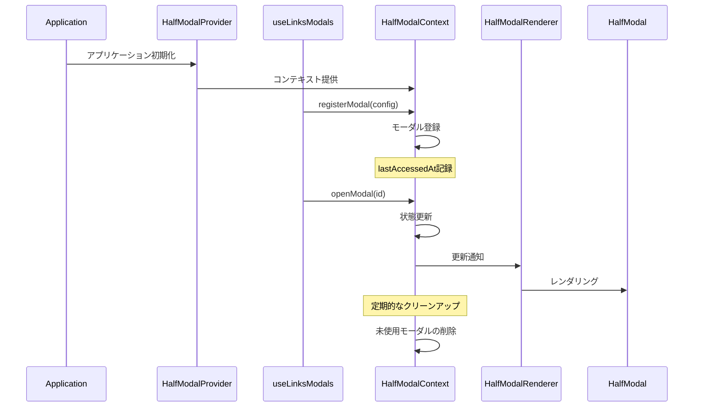

# HalfModal Documentation

## 概要
HalfModalは、画面下部から表示されるモーダルUIコンポーネントです。アプリケーション全体で統一されたモーダル体験を提供します。メモリ管理と自動クリーンアップ機能を備えています。

## アーキテクチャ

### コンポーネント構成
```
half-modal/
├── HalfModal.tsx          # モーダルの基本UIコンポーネント
├── HalfModalContext.tsx   # モーダル状態管理のコンテキスト
├── HalfModalRenderer.tsx  # 登録されたモーダルのレンダリング
└── types.ts              # 型定義
```

### 基本シーケンス図



## メモリ管理

### 自動クリーンアップ
```typescript
const CLEANUP_INTERVAL = 5 * 60 * 1000;  // 5分
const MAX_MODAL_COUNT = 10;
const MODAL_TIMEOUT = 10 * 60 * 1000;    // 10分

// 未使用モーダルの自動削除
// - 開いていないモーダル
// - 最後のアクセスから10分以上経過
```

### メモリ使用量の監視
```typescript
// モーダル数の監視
if (modals.size > MAX_MODAL_COUNT) {
  console.warn(`Warning: Large number of modals registered (${modals.size})`);
}
```

## 使用方法

### 1. プロバイダーの設定
```tsx
// App.tsx
import { HalfModalProvider } from '@/components/layout/half-modal';

export default function App() {
  return (
    <HalfModalProvider>
      <YourApp />
    </HalfModalProvider>
  );
}
```

### 2. モーダルの定義
```tsx
// YourModalView.tsx
import { type HalfModalProps } from '@/components/layout/half-modal/types';

export const YourModalView = memo(function YourModalView({ onClose }: HalfModalProps) {
  return (
    <View>
      <Text>モーダルコンテンツ</Text>
      <Button onPress={onClose} title="閉じる" />
    </View>
  );
});
```

### 3. カスタムフックの作成
```typescript
// useYourModals.ts
const MODAL_IDS = {
  YOUR_MODAL: "your-modal",
} as const;

type ModalId = typeof MODAL_IDS[keyof typeof MODAL_IDS];

const MODAL_COMPONENTS = {
  [MODAL_IDS.YOUR_MODAL]: YourModalView,
} as const;

export const useYourModals = () => {
  const { registerModal, unregisterModal, openModal, closeModal } = useHalfModal();
  const registeredModals = useRef<Set<ModalId>>(new Set());

  const registerModalIfNeeded = useCallback((id: ModalId) => {
    if (registeredModals.current.has(id)) return;

    const component = MODAL_COMPONENTS[id];
    if (!component) {
      console.error(`Modal component not found for id: ${id}`);
      return;
    }

    try {
      registerModal({
        id,
        component,
        onClose: () => closeModal(id),
      });
      registeredModals.current.add(id);
    } catch (error) {
      console.error(`Failed to register modal: ${id}`, error);
    }
  }, [registerModal, closeModal]);

  useEffect(() => {
    const modalsRef = registeredModals.current;
    return () => {
      modalsRef.forEach(id => unregisterModal(id));
      modalsRef.clear();
    };
  }, [unregisterModal]);

  return {
    openModal: useCallback(() => {
      registerModalIfNeeded(MODAL_IDS.YOUR_MODAL);
      openModal(MODAL_IDS.YOUR_MODAL);
    }, [registerModalIfNeeded, openModal]),
    closeModal: useCallback(() => closeModal(MODAL_IDS.YOUR_MODAL), [closeModal]),
  };
};
```

## ベストプラクティス

1. **型安全性の確保**
   - モーダルIDの型定義
   - コンポーネントマッピングの型安全性
   ```typescript
   type ModalId = typeof MODAL_IDS[keyof typeof MODAL_IDS];
   ```

2. **メモリ管理**
   - 遅延登録の活用
   - 適切なクリーンアップ
   - モーダル数の監視

3. **エラーハンドリング**
   - コンポーネント存在チェック
   - 登録エラーのハンドリング
   - 適切なエラーメッセージ

4. **パフォーマンス考慮**
   - 不要なレンダリングの防止
   - メモリリークの防止
   - 自動クリーンアップの活用

## 注意点

1. **循環参照の防止**
   - モーダル関連のインポートは直接行う
   - index.tsからの一括インポートは避ける

2. **型安全性**
   - `HalfModalProps`を必ず使用
   - モーダルIDの型定義を活用
   - コンポーネントマッピングの型チェック

3. **クリーンアップ**
   - `useEffect`内での適切な参照の保持
   - 登録済みモーダルの適切な解放
   - メモリリークの防止

## 実装例

Links機能での実装例は[実際の利用例](#実際の利用例)を参照してください。 