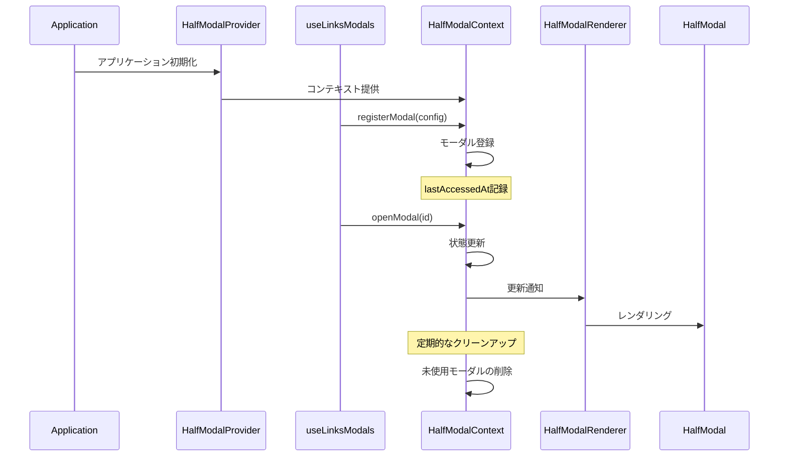

# HalfModal Documentation

## 概要

HalfModalは、画面下部から表示されるモーダルUIコンポーネントです。アプリケーション全体で統一されたモーダル体験を提供します。メモリ管理と自動クリーンアップ機能を備えています。

## アーキテクチャ

### コンポーネント構成

```plaintext
half-modal/
├── HalfModal.tsx          # モーダルの基本UIコンポーネント
├── HalfModalContext.tsx   # モーダル状態管理のコンテキスト
├── HalfModalRenderer.tsx  # 登録されたモーダルのレンダリング
└── types.ts              # 型定義
```

### プロバイダー構成

機能ごとのモーダルは、それぞれ独立したコンテキストとして管理することができます。

```plaintext
feature/links/
└── application/
    └── context/
        ├── ModalProvider.tsx          # 機能全体のモーダル管理
        ├── LinkInputModalContext.tsx  # リンク入力モーダル用コンテキスト
        └── LinkActionModalContext.tsx # リンクアクション用コンテキスト
```

### プロバイダーの構成例

```tsx
// ModalProvider.tsx
export const ModalProvider = ({ children }: ModalProviderProps) => {
  return (
    <LinkInputModalProvider>
      <LinkActionModalProvider>{children}</LinkActionModalProvider>
    </LinkInputModalProvider>
  );
};
```

この構成により：

- 各モーダルの状態を独立して管理
- 関心の分離を実現
- モーダル間の依存関係を明確化

### プロバイダーの使用方法

```tsx
// App.tsx または機能のルートコンポーネント
import { ModalProvider } from "@/feature/links/application/context/ModalProvider";

export const LinksFeature = () => {
  return (
    <ModalProvider>
      <YourFeatureComponents />
    </ModalProvider>
  );
};
```

### 基本シーケンス図



## メモリ管理

### 自動クリーンアップ

```typescript
const CLEANUP_INTERVAL = 5 * 60 * 1000; // 5分
const MAX_MODAL_COUNT = 10;
const MODAL_TIMEOUT = 10 * 60 * 1000; // 10分

// 未使用モーダルの自動削除
// - 開いていないモーダル
// - 最後のアクセスから10分以上経過
```

### メモリ使用量の監視

```typescript
// モーダル数の監視
if (modals.size > MAX_MODAL_COUNT) {
  console.warn(`Warning: Large number of modals registered (${modals.size})`);
}
```

## 使用方法

### 1. プロバイダーの設定

```tsx
// App.tsx
import { HalfModalProvider } from "@/components/layout/half-modal";

export default function App() {
  return (
    <HalfModalProvider>
      <YourApp />
    </HalfModalProvider>
  );
}
```

### 2. モーダルの定義

```tsx
// YourModalView.tsx
import { type HalfModalProps } from "@/components/layout/half-modal/types";

export const YourModalView = memo(function YourModalView({
  onClose,
}: HalfModalProps) {
  return (
    <View>
      <Text>モーダルコンテンツ</Text>
      <Button onPress={onClose} title="閉じる" />
    </View>
  );
});
```

### 3. カスタムフックの実装

```typescript
// useYourModals.ts
type ModalViews = Partial<{
  ModalA: React.ComponentType<HalfModalProps>;
  ModalB: React.ComponentType<HalfModalProps>;
}>;

const MODAL_IDS = {
  MODAL_A: "modal-a",
  MODAL_B: "modal-b",
} as const;

type ModalId = typeof MODAL_IDS[keyof typeof MODAL_IDS];

export const useYourModals = (views: ModalViews = {}) => {
  const { registerModal, unregisterModal, openModal, closeModal } = useHalfModal();
  const registeredModals = useRef<Set<ModalId>>(new Set());

  const registerModalIfNeeded = useCallback(
    (id: ModalId) => {
      if (registeredModals.current.has(id)) return;

      try {
        const component = getModalComponent(id, views);
        if (!component) {
          console.error(`Modal component not found for id: ${id}`);
          return;
        }

        registerModal({
          id,
          component,
          onClose: () => closeModal(id),
        });
        registeredModals.current.add(id);
      } catch (error) {
        console.error(`Failed to register modal: ${id}`, error);
      }
    },
    [registerModal, closeModal, views],
  );

  // クリーンアップ
  useEffect(() => {
    const modalsRef = registeredModals.current;
    return () => {
      modalsRef.forEach(id => unregisterModal(id));
      modalsRef.clear();
    };
  }, [unregisterModal]);

  return {
    openModalA: views.ModalA ? () => {
      registerModalIfNeeded(MODAL_IDS.MODAL_A);
      openModal(MODAL_IDS.MODAL_A);
    } : noop,
    closeModalA: views.ModalA ? () => closeModal(MODAL_IDS.MODAL_A) : noop,
    // ... 他のモーダル操作
  };
};
```

### 4. コンポーネントでの使用

```tsx
const YourComponent = () => {
  const { openModalA } = useYourModals({
    ModalA: YourModalView,
  });

  return <Button onPress={openModalA} title="モーダルを開く" />;
};
```

## 実装上の懸念点と対策

### 1. パフォーマンスの考慮

- **懸念**: 不要なモーダルコンポーネントの登録による初期ロードの遅延
- **対策**: 
  - Partial型を使用して必要なモーダルのみを受け取る
  - 遅延登録による初期ロードの最適化
  - 未使用モーダルの自動クリーンアップ

### 2. メモリリーク

- **懸念**: モーダルの登録解除忘れによるメモリリーク
- **対策**:
  - useEffectでのクリーンアップ処理の実装
  - 登録済みモーダルの追跡
  - 定期的な未使用モーダルの削除

### 3. 型安全性

- **懸念**: モーダルIDと対応するコンポーネントの不一致
- **対策**:
  - 厳格な型定義による不整合の防止
  - コンパイル時のエラー検出
  - Partial型による柔軟な型チェック

### 4. エラーハンドリング

- **懸念**: モーダル登録・表示時の予期せぬエラー
- **対策**:
  - try-catchによるエラー捕捉
  - エラーログの出力
  - フォールバック処理（noop関数）の提供

### 5. 再レンダリング

- **懸念**: 不要な再レンダリングによるパフォーマンス低下
- **対策**:
  - useCallbackによるメモ化
  - 条件付きレンダリングの最適化
  - コンポーネントのメモ化推奨

## ベストプラクティス

1. **型安全性の確保**
   - モーダルIDの型定義
   - コンポーネントマッピングの型安全性
   - Partial型による柔軟な実装

2. **メモリ管理**
   - 遅延登録の活用
   - 適切なクリーンアップ
   - モーダル数の監視

3. **エラーハンドリング**
   - コンポーネント存在チェック
   - 登録エラーのハンドリング
   - 適切なエラーメッセージ

4. **パフォーマンス考慮**
   - 不要なレンダリングの防止
   - メモリリークの防止
   - 自動クリーンアップの活用

5. **モーダルの分離**
   - 機能ごとに独立したモーダルコンテキストを作成
   - プロバイダーの適切な階層構造を維持
   - モーダル間の独立性を確保

## 注意点

1. **循環参照の防止**
   - モーダル関連のインポートは直接行う
   - index.tsからの一括インポートは避ける

2. **型安全性**
   - `HalfModalProps`を必ず使用
   - モーダルIDの型定義を活用
   - コンポーネントマッピングの型チェック

3. **クリーンアップ**
   - `useEffect`内での適切な参照の保持
   - 登録済みモーダルの適切な解放
   - メモリリークの防止
