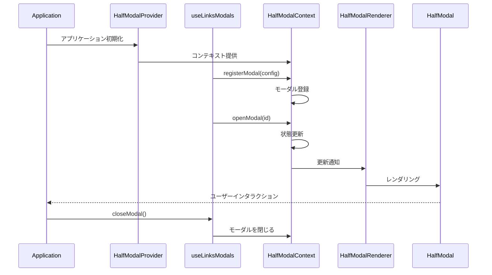
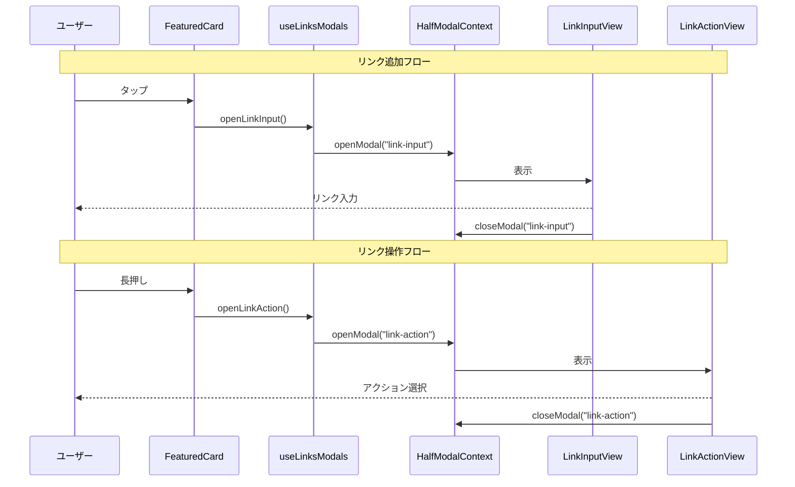

# HalfModal Documentation

## 概要
HalfModalは、画面下部から表示されるモーダルUIコンポーネントです。アプリケーション全体で統一されたモーダル体験を提供します。

## アーキテクチャ

### コンポーネント構成
```
half-modal/
├── HalfModal.tsx          # モーダルの基本UIコンポーネント
├── HalfModalContext.tsx   # モーダル状態管理のコンテキスト
├── HalfModalRenderer.tsx  # 登録されたモーダルのレンダリング
└── types.ts              # 型定義
```

### 基本シーケンス図



### 実際の利用シーケンス図



## 使用方法

### 1. プロバイダーの設定
```tsx
// App.tsx
import { HalfModalProvider } from './components/layout/half-modal';

export default function App() {
  return (
    <HalfModalProvider>
      <YourApp />
    </HalfModalProvider>
  );
}
```

### 2. モーダルの定義
```tsx
// YourModalView.tsx
import { type HalfModalProps } from '@/components/layout/half-modal/types';

export const YourModalView = ({ onClose }: HalfModalProps) => {
  return (
    <View>
      <Text>モーダルコンテンツ</Text>
      <Button onPress={onClose} title="閉じる" />
    </View>
  );
};
```

### 3. カスタムフックの作成
```tsx
// useYourModals.ts
import { useHalfModal } from '@/components/layout/half-modal';

export const useYourModals = () => {
  const { registerModal, unregisterModal, openModal, closeModal } = useHalfModal();
  
  useEffect(() => {
    registerModal({
      id: 'your-modal',
      component: YourModalView,
      onClose: () => closeModal('your-modal'),
    });

    return () => unregisterModal('your-modal');
  }, []);

  return {
    openYourModal: () => openModal('your-modal'),
    closeYourModal: () => closeModal('your-modal'),
  };
};
```

### 4. モーダルの使用
```tsx
// YourComponent.tsx
export const YourComponent = () => {
  const { openYourModal } = useYourModals();

  return (
    <Button 
      onPress={openYourModal}
      title="モーダルを開く" 
    />
  );
};
```

## ベストプラクティス

1. **モーダルIDの管理**
   - モーダルIDは定数として管理
   - 機能ごとにプレフィックスをつける
   ```tsx
   const MODAL_IDS = {
     LINK_INPUT: 'link-input',
     LINK_ACTION: 'link-action',
   } as const;
   ```

2. **コンポーネントの責務**
   - モーダルコンポーネントは表示のみを担当
   - ビジネスロジックは親コンポーネントまたはカスタムフックで管理

3. **パフォーマンス考慮**
   - 不要なレンダリングを避けるため、`memo`を使用
   - モーダルの登録は`useEffect`内で一度だけ行う

4. **エラー処理**
   - モーダルの登録・解除は適切に行う
   - コンポーネントのアンマウント時に必ずモーダルを解除

## 注意点

1. 循環参照の防止
   - モーダル関連のインポートは直接行う
   - index.tsからの一括インポートは避ける

2. 型安全性
   - `HalfModalProps`を必ず使用する
   - 独自のpropsは`HalfModalProps`を拡張する

3. クリーンアップ
   - コンポーネントのアンマウント時にモーダルを解除
   - メモリリークを防ぐ

## 実装例

```tsx
// useLinksModals.ts
export const useLinksModals = () => {
  const { registerModal, unregisterModal, openModal, closeModal } = useHalfModal();
  const isRegistered = useRef(false);

  useEffect(() => {
    if (isRegistered.current) return;

    registerModal({
      id: MODAL_IDS.LINK_INPUT,
      component: LinkInputView,
      onClose: () => closeModal(MODAL_IDS.LINK_INPUT),
    });

    isRegistered.current = true;
    return () => {
      unregisterModal(MODAL_IDS.LINK_INPUT);
      isRegistered.current = false;
    };
  }, []);

  return {
    openLinkInput: () => openModal(MODAL_IDS.LINK_INPUT),
    closeLinkInput: () => closeModal(MODAL_IDS.LINK_INPUT),
  };
};
```

## 実際の利用例

### Links機能でのモーダル利用

1. **モーダルの種類**
   ```typescript
   const MODAL_IDS = {
     LINK_INPUT: "link-input",    // リンク追加モーダル
     LINK_ACTION: "link-action",  // リンク操作モーダル
   } as const;
   ```

2. **モーダル管理フック**
   ```typescript
   // useLinksModals.ts
   export const useLinksModals = () => {
     const { registerModal, unregisterModal, openModal, closeModal } = useHalfModal();
     const isRegistered = useRef(false);

     useEffect(() => {
       if (isRegistered.current) return;

       // リンク入力モーダルの登録
       registerModal({
         id: MODAL_IDS.LINK_INPUT,
         component: LinkInputView,
         onClose: () => closeModal(MODAL_IDS.LINK_INPUT),
       });

       // リンクアクションモーダルの登録
       registerModal({
         id: MODAL_IDS.LINK_ACTION,
         component: LinkActionView,
         onClose: () => closeModal(MODAL_IDS.LINK_ACTION),
       });

       isRegistered.current = true;
       return () => {
         unregisterModal(MODAL_IDS.LINK_INPUT);
         unregisterModal(MODAL_IDS.LINK_ACTION);
         isRegistered.current = false;
       };
     }, []);

     return {
       openLinkInput: () => openModal(MODAL_IDS.LINK_INPUT),
       closeLinkInput: () => closeModal(MODAL_IDS.LINK_INPUT),
       openLinkAction: () => openModal(MODAL_IDS.LINK_ACTION),
       closeLinkAction: () => closeModal(MODAL_IDS.LINK_ACTION),
     };
   };
   ```

3. **モーダルの呼び出し**
   ```typescript
   // FeaturedCard.tsx
   export const FeaturedLinksCard = ({ onAction }: FeaturedLinksCardProps) => {
     const handleLongPress = () => {
       onAction?.();  // LinkActionViewを表示
     };

     return (
       <PressableCard onLongPress={handleLongPress}>
         {/* ... */}
       </PressableCard>
     );
   };
   ```

4. **モーダルコンポーネント**
   ```typescript
   // LinkInputView.tsx
   export const LinkInputView = ({ onClose }: HalfModalProps) => {
     const { handleAddLink } = useLinkInput();

     return (
       <View>
         <LinkInputForm />
         <LinkInputActions
           onCancel={onClose}
           onAdd={handleAddLink}
         />
       </View>
     );
   };
   ``` 