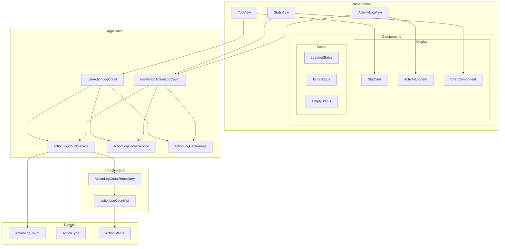
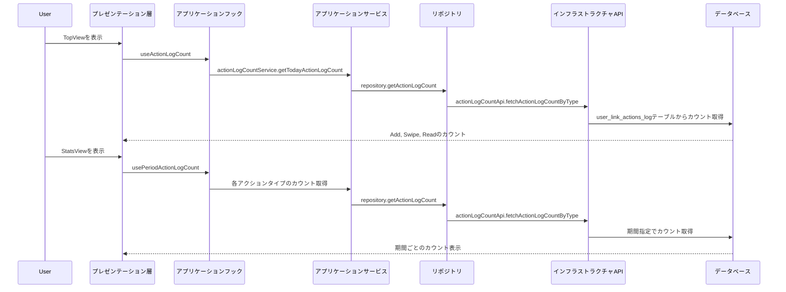

# ダッシュボード機能アーキテクチャ

このドキュメントでは、ダッシュボード機能のアーキテクチャについて説明します。

## コンポーネントアーキテクチャ



## レイヤー構造

1. **プレゼンテーション層**:

   - **ビュー**:
     - `TopView`: ダッシュボードのトップビュー
     - `StatsView`: 統計情報表示ビュー
     - `ActivityLogView`: アクティビティログ表示ビュー
   - **コンポーネント**:
     - **表示**:
       - `StatCard`: 統計情報カード
       - `ActivityLogItem`: アクティビティログアイテム
       - `ChartComponent`: チャート表示コンポーネント
     - **状態**:
       - `LoadingStatus`: ローディング状態
       - `ErrorStatus`: エラー状態
       - `EmptyStatus`: データなし状態

2. **アプリケーション層**:

   - **フック**:
     - `useActionLogCount`: 今日のアクションログカウント取得フック
     - `usePeriodActionLogCount`: 期間指定アクションログカウント取得フック
   - **サービス**:
     - `actionLogCountService`: アクションログカウントサービス
   - **キャッシュ**:
     - `actionLogCacheService`: キャッシュ更新サービス
     - `actionLogCacheKeys`: キャッシュキー定義

3. **ドメイン層**:

   - **モデル**:
     - `ActionLogCount`: アクションログカウントモデル
     - `ActionType`: アクションタイプ定義
     - `ActionStatus`: アクションステータス定義

4. **インフラストラクチャ層**:
   - **API**:
     - `actionLogCountApi`: アクションログカウント取得API
     - `ActionLogCountRepository`: アクションログカウントリポジトリ

## データフロー



## アーキテクチャの特徴

1. **クリーンアーキテクチャの採用**:

   - 各レイヤーの責務を明確に分離
   - 依存関係の方向は内側に向かう
   - ドメインロジックはインフラストラクチャに依存しない

2. **SWRによるデータ取得とキャッシュ**:

   - データの自動再検証
   - キャッシュの一元管理
   - フォーカス時の再取得

3. **リポジトリパターン**:

   - データアクセスロジックの抽象化
   - テスト容易性の向上
   - 実装の詳細を隠蔽

4. **型安全性**:
   - 厳格な型定義
   - コンパイル時のエラー検出
   - 保守性の向上

## 主要なコンポーネントの責務

### TopView

ダッシュボードのトップビューで、今日のアクションログカウント（Add, Swipe,
Read）を表示します。

```typescript
export const TopView = () => {
  const { session } = useSession();
  const userId = session?.user?.id || "";
  const { data: actionLogCount, isLoading, error } = useActionLogCount(userId);

  // アクションログカウントのデータを準備
  const stats = [
    {
      title: "Add",
      value: isLoading ? "-" : actionLogCount ? actionLogCount.add.toString() : "0",
      icon: LinkIcon
    },
    // ...
  ];

  return (
    <View>
      {/* StatCardコンポーネントでカウントを表示 */}
      {stats.map((stat) => (
        <StatCard
          key={stat.title}
          title={stat.title}
          value={stat.value}
          Icon={stat.icon}
        />
      ))}
    </View>
  );
};
```

### useActionLogCount

今日のアクションログカウントを取得するカスタムフックです。

```typescript
export const useActionLogCount = (userId: string) => {
  // SWRを使用してデータを取得
  const { data, error, isLoading, mutate } = useSWR(
    userId ? ACTION_LOG_CACHE_KEYS.TODAY_ACTION_LOG_COUNT(userId) : null,
    async () => {
      if (!userId) {
        return null;
      }
      const repository = new ActionLogCountRepository();
      const service = new ActionLogCountService(repository);
      return service.getTodayActionLogCount(userId);
    },
    {
      revalidateOnFocus: true,
      revalidateOnReconnect: true,
      dedupingInterval: 60000,
      errorRetryCount: 3,
    },
  );

  return { data, error, isLoading, mutate };
};
```

### actionLogCountService

アクションログカウントのビジネスロジックを実装するサービスです。

```typescript
export class ActionLogCountService implements IActionLogCountService {
  constructor(
    private readonly actionLogCountRepository: IActionLogCountRepository,
  ) {}

  async getTodayActionLogCount(userId: string): Promise<ActionLogCount> {
    const today = new Date();
    const startDate = today.toISOString().split("T")[0];
    const endDate = startDate;

    try {
      // 各アクションタイプごとのカウントを取得
      const addCount = await this.actionLogCountRepository.getActionLogCount({
        userId,
        actionType: ActionType.ADD,
        startDate,
        endDate,
      });
      // ...

      return {
        add: addCount,
        swipe: swipeCount,
        read: readCount,
      };
    } catch (error) {
      console.error("アクションログカウントの取得に失敗しました:", error);
      throw error;
    }
  }
}
```

### actionLogCountApi

データベースからアクションログカウントを取得するAPIです。

```typescript
export const actionLogCountApi = {
  fetchActionLogCountByType: async (params: {
    userId: string;
    actionType: ActionType;
    startDate?: string;
    endDate?: string;
  }): Promise<number> => {
    try {
      // アクションタイプに対応するステータスのリストを取得
      const statuses = Object.entries(statusToTypeMap)
        .filter(([_, type]) => type === params.actionType)
        .map(([status, _]) => status);

      // ...

      let query = supabase
        .from("user_link_actions_log")
        .select("*", { count: "exact", head: true })
        .eq("user_id", params.userId)
        .in("new_status", statuses);

      // ...

      const { count, error } = await query;

      if (error) {
        throw error;
      }

      return count || 0;
    } catch (error) {
      console.error("Error fetching action log count by type:", error);
      throw error;
    }
  },
};
```

## 拡張性と保守性

1. **新しい統計情報の追加**:

   - 新しいアクションタイプを`ActionType`に追加
   - 対応するステータスを`ActionStatus`に追加
   - `statusToTypeMap`にマッピングを追加

2. **期間指定の柔軟性**:

   - 日次、週次、月次など様々な期間での集計が可能
   - `usePeriodActionLogCount`フックで期間を指定

3. **表示コンポーネントの独立性**:

   - データ取得ロジックと表示ロジックの分離
   - 再利用可能なコンポーネント設計

4. **キャッシュ戦略**:
   - キャッシュキーの一元管理
   - キャッシュ更新ロジックの集約
   - パターンマッチングによる効率的なキャッシュ更新

## 今後の改善点

1. **リアルタイム更新**:

   - Supabaseのリアルタイムサブスクリプションを活用
   - アクションログの変更をリアルタイムで反映

2. **グラフ表示の強化**:

   - 時系列データの視覚化
   - インタラクティブなグラフコンポーネント

3. **フィルタリング機能**:

   - ユーザー定義のフィルター
   - カスタム期間の指定

4. **エクスポート機能**:

   - CSVやPDF形式でのデータエクスポート
   - レポート生成機能

5. **パフォーマンス最適化**:
   - クエリの効率化
   - キャッシュ戦略の改善
   - レンダリングの最適化
