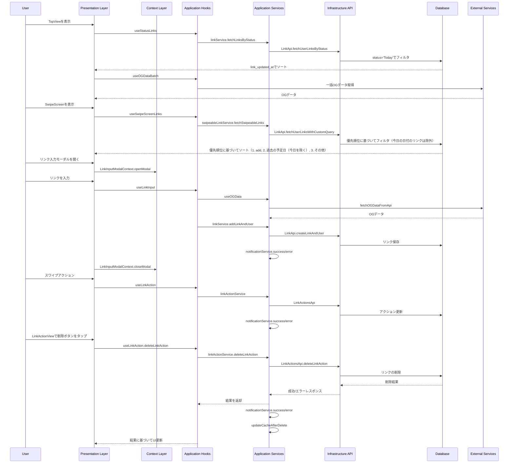

# Links Feature Architecture

This document describes the architecture of the Links feature using Mermaid
diagrams.

## Component Architecture

```mermaid
graph TD
    %% Layers
    subgraph Presentation
        LinkInputView
        SwipeScreen
        TodaysLinksView
        LinkActionView
        LinkListView
        WeeekEndLinksView

        subgraph Components
            subgraph Lists
                LinksFlatList
                FeaturedLinksList
            end

            subgraph Cards
                HorizontalCard
                FeaturedLinksCard
                LinkInfoCard
            end

            subgraph Status
                ErrorStatus
                SwipeScreenErrorStatus
                LoadingStatus
                TodaysLinksNoStatus
                WeeekEndLinksNoStatus
            end

            subgraph Preview
                LinkPreview
            end

            subgraph Filters
                LinkFilterTabs
                StatusFilter
            end
        end
    end

    subgraph Application
        LinkInputModalContext
        useLinkInput
        useSwipeScreenLinks
        useWebBrowser
        useLinkAction
        useOGData
        useOGDataBatch
        useUserAllLinks
        useLinksFiltering
        cardService
        linkActionService
        notificationService
        linkCacheService
        linkCacheKeys
        linkFilterService
    end

    subgraph Domain
        Card
        Link
        LinkInsert
        LinkRow
        OGData
        IWebBrowserService
        LinkQueryParams
        UserLink
        BaseUserLinkActions
        LinkTabConfig
    end

    subgraph Infrastructure
        WebBrowserService
        LinkActionsApi
        LinkApi
        OGApi
        fetchOGDataFromApi
    end

    %% Relationships
    LinkInputView --> LinkInputModalContext
    LinkInputView --> useLinkInput
    LinkInputView --> LinkPreview
    LinkPreview --> LinkInfoCard
    LinkPreview --> LoadingStatus
    SwipeScreen --> useSwipeScreenLinks
    SwipeScreen --> useLinkAction
    SwipeScreen --> SwipeScreenErrorStatus
    TodaysLinksView --> useStatusLinks
    TodaysLinksView --> useOGDataBatch
    TodaysLinksView --> ErrorStatus
    WeeekEndLinksView --> useStatusLinks
    WeeekEndLinksView --> useOGDataBatch
    WeeekEndLinksView --> ErrorStatus
    LinksFlatList --> HorizontalCard
    FeaturedLinksList --> FeaturedLinksCard
    LinkActionView --> useLinkAction
    LinkActionView --> HorizontalCard
    LinksFlatList --> LinkActionView
    FeaturedLinksList --> LinkActionView
    LinkListView --> LinkFilterTabs
    LinkListView --> StatusFilter

    useStatusLinks --> linkService
    useSwipeScreenLinks --> linkService
    linkService --> LinkApi
    useLinkInput --> LinkApi
    useLinkInput --> useOGData
    useOGData --> OGApi
    useOGDataBatch --> OGApi
    useOGData --> fetchOGDataFromApi
    useLinkAction --> linkActionService
    linkActionService --> LinkActionsApi
    linkActionService --> notificationService
    useWebBrowser --> WebBrowserService
    useUserAllLinks --> linkService
    useLinksFiltering --> linkFilterService

    WebBrowserService -.implements.-> IWebBrowserService
    Link -.extends.-> LinkRow
    Card -.uses.-> Link
    Card -.uses.-> OGData
    UserLink -.uses.-> BaseUserLinkActions

    %% Services
    LinkApi --> LinkQueryParams
    LinkApi --> LinkInsert
    LinkActionsApi --> LinkRow
    OGApi --> OGData
```



## Data Flow



## Architecture Overview

1. **レイヤー構造**:

   - **Presentation**: UIコンポーネント

     - Views:
       - TodaysLinksView: 今日読むリンクの表示
       - SwipeScreen: リンクのスワイプ操作
       - LinkInputView: リンク入力モーダル
       - LinkActionView: リンクアクション（削除など）の実行、リンク詳細の表示
       - LinkListView: すべてのリンクを表示し、フィルタリング機能を提供
       - WeeekEndLinksView: 週末のリンク表示
     - Components:
       - Lists:
         - FeaturedLinksList: 注目リンクの表示
         - LinksFlatList: 通常リンクのリスト表示
       - Cards:
         - FeaturedLinksCard: 注目リンクカード
         - HorizontalCard: 通常リンクカード
         - LinkInfoCard: リンク情報表示
       - Status:
         - ErrorStatus: 汎用エラー表示
         - SwipeScreenErrorStatus: スワイプ画面用エラー表示
         - LoadingStatus: ローディング表示
         - TodaysLinksNoStatus: 空状態表示
         - WeeekEndLinksNoStatus: 週末の空状態表示
       - Preview:
         - LinkPreview: リンクプレビュー表示
       - Filters:
         - LinkFilterTabs: リンクをタブでフィルタリング（To ReadとReadの2タブ）
         - StatusFilter: リンクステータスによるフィルタリング

   - **Context**: 状態管理

     - LinkInputModalContext: モーダル表示状態の管理

   - **Application**: ビジネスロジック

     - Hooks:
       - useStatusLinks: 特定ステータスのリンク取得（"Today", "inWeekend"など）
       - useTodaysLinks: Today状態のリンク取得（useStatusLinksのラッパー）
       - useSwipeScreenLinks: スワイプ可能なリンク取得
       - useLinkInput: リンク入力とOGデータ取得
       - useOGData: 個別OGデータのキャッシュと取得
       - useOGDataBatch: 複数リンクのOGデータ一括取得
       - useLinkAction: リンクアクション（削除・更新）の管理
       - useUserAllLinks: すべてのユーザーリンクを取得
       - useLinksFiltering: リンクのフィルタリングロジック
     - Services:
       - linkService: リンク操作の中心的なロジック
       - linkActionService: リンクアクション管理
       - cardService: カード表示用のデータ加工
       - notificationService: 通知表示の統一管理
       - linkCacheService: キャッシュ更新の中央管理
       - linkCacheKeys: キャッシュキーの一元管理
       - linkFilterService: リンクフィルタリングのビジネスロジック

   - **Domain**: モデルと型定義

     - Link: 基本的なリンクモデル
     - UserLink: ユーザーリンク情報
     - BaseUserLinkActions: リンクアクション基本型
     - OGData: OGデータの型定義
     - LinkQueryParams: クエリパラメータの型定義
     - LinkTabConfig: リンクタブの設定と関連ステータスの定義

   - **Infrastructure**: 外部サービス連携
     - LinkApi: Supabaseとの通信
     - LinkActionsApi: アクション関連のAPI
     - OGApi: OGデータ取得
     - WebBrowserService: ブラウザ制御

2. **主要な機能フロー**:

   - **TopView表示**

     - Todayステータスのリンク取得
     - 一括OGデータ取得による最適化
     - Featured/通常リンクの分離表示

   - **リンク入力とプレビュー**

     - モーダル管理による UI/UX 改善
     - URLのバリデーション
     - リアルタイムOGデータプレビュー
     - 成功/エラー通知の統一管理

   - **SwipeScreen表示**

     - 効率的なリンクフィルタリング（scheduled_read_atが今日の日付や未来の日付のものを除外）
     - link_updated_atによる古い順のソート
     - スワイプアクションの最適化

   - **リンク削除**

     - URLパラメータからのリンクID取得
     - 削除処理の実行と結果確認
     - 統一された通知サービスによるユーザーフィードバック
     - キャッシュ更新サービスによる効率的なUI更新

   - **リンクアクション**

     - LinkActionViewでのリンク詳細表示
     - リンク削除機能
     - リンクのマーク機能
       - Reading, Read, Re-Read, Bookmarkの4種類のマークタイプ
       - マークタイプに応じたステータス更新
       - Readingの場合はread_atを更新しない
       - その他のマークタイプの場合はread_atに現在時刻を設定
     - リンク情報の直接表示によるUX向上
     - キャッシュ更新による効率的なUI更新

   - **キャッシュ中央管理**
     - キャッシュキーの一元管理（linkCacheKeys）
     - キャッシュ更新ロジックの集約（linkCacheService）
     - 各種キャッシュ更新パターンの標準化
     - パターンマッチングによる効率的なキャッシュ更新
     - フックとサービス間の連携強化

3. **データの流れ**:

   - **取得フロー**:

     1. Context層: 状態管理
     2. UI層: フック呼び出し
     3. Application層: ビジネスロジック適用
     4. Infrastructure層: データベースクエリ実行

   - **更新フロー**:

     1. Context層: モーダル状態更新
     2. UI層: アクション発生
     3. Application層: 状態更新ロジック
     4. Infrastructure層: データベース更新

   - **削除フロー**:
     1. UI層: 削除アクション発生
     2. Application層: 削除ロジック実行
     3. Infrastructure層: データベースからのレコード削除
     4. Application層: キャッシュ更新と通知表示
     5. UI層: 結果に基づくUI更新

4. **エラーハンドリング**:

   - URLバリデーション
   - OGデータ取得エラー
   - 各層での適切なエラー捕捉
   - UIでのエラー表示の改善
   - 空の状態の適切な処理
   - 統一された通知サービスによるエラー表示

5. **パフォーマンス最適化**:

   - SWRによるキャッシュ
   - OGデータの一括取得
   - モーダル状態の最適化
   - 効率的なクエリ実行
   - キャッシュ更新戦略の改善

6. **キャッシュ更新戦略**:

   - **選択的キャッシュ更新**:
     - 特定のキーに基づくキャッシュの更新
     - パターンマッチングによる関連キャッシュの一括更新
   - **キャッシュ更新サービス**:
     - linkActionService.updateCacheAfterDelete: 削除後のキャッシュ更新
     - 複数のキャッシュキーを一度に更新
   - **キャッシュキー設計**:
     - 機能別のキャッシュキー: ["today-links", userId]
     - 汎用的なキャッシュキー: [`user-links-${userId}`, limit]
     - パターンマッチング: (key) => Array.isArray(key) &&
       key[0].includes("links")

7. **拡張性**:
   - コンテキストベースの状態管理
   - フック単位での機能拡張
   - 表示コンポーネントの独立性
   - データ取得の最適化オプション
   - サービス層の分離による責務の明確化

## Testing Strategy

1. **テスト構造**:

   ```
   feature/links/
   ├── __tests__/
   │   ├── presentation/
   │   │   ├── components/
   │   │   │   ├── lists/
   │   │   │   │   ├── FeaturedLinksList.test.tsx
   │   │   │   │   └── LinksFlatList.test.tsx
   │   │   │   ├── cards/
   │   │   │   │   ├── FeaturedLinksCard.test.tsx
   │   │   │   │   ├── HorizontalCard.test.tsx
   │   │   │   │   └── LinkInfoCard.test.tsx
   │   │   │   ├── status/
   │   │   │   │   ├── ErrorStatus.test.tsx
   │   │   │   │   ├── SwipeScreenErrorStatus.test.tsx
   │   │   │   │   └── LoadingStatus.test.tsx
   │   │   │   └── preview/
   │   │   │       └── LinkPreview.test.tsx
   │   │   └── views/
   │   │       ├── TodaysLinksView.test.tsx
   │   │       ├── SwipeScreen.test.tsx
   │   │       ├── LinkInputView.test.tsx
   │   │       └── LinkActionView.test.tsx
   │   ├── application/
   │   │   ├── hooks/
   │   │   │   ├── useOGDataBatch.test.ts
   │   │   │   ├── useLinkInput.test.ts
   │   │   │   └── useLinkAction.test.ts
   │   │   ├── context/
   │   │   │   └── LinkInputModalContext.test.tsx
   │   │   └── service/
   │   │       ├── linkService.test.ts
   │   │       ├── linkActionService.test.ts
   │   │       ├── notificationService.test.ts
   │   │       ├── linkCacheService.test.ts
   │   │       └── linkCacheKeys.test.ts
   │   └── infrastructure/
   │       └── api/
   │           ├── linkApi.test.ts
   │           └── linkActionsApi.test.ts
   ```

2. **テスト種別**:

   - **単体テスト**

     - コンポーネントの表示状態
       - 各種ステータス表示の検証
       - エラーメッセージの表示
       - ローディング状態の表示
     - フックのロジック
     - サービスのメソッド
     - APIの呼び出し

   - **統合テスト**

     - TopViewの表示フロー
     - リンク入力からプレビュー
     - スワイプアクションフロー
     - 通知サービスとの連携

   - **E2Eテスト**
     - ユーザーシナリオ
     - エラーハンドリング
     - パフォーマンス

3. **テスト優先度**:

   - **High**

     - リンク入力バリデーション
     - OGデータ取得
     - スワイプアクション
     - エラー表示
     - 通知表示

   - **Medium**

     - UI表示の整合性
     - データ更新の反映
     - キャッシュの動作

   - **Low**
     - エッジケース
     - 特殊な入力値
     - 極端な負荷状態

4. **テストカバレッジ目標**:

   - **Presentation**: 80%
   - **Application**: 90%
   - **Infrastructure**: 85%
   - **全体**: 85%以上

5. **テスト環境**:

   - Jest + React Testing Library
   - MSW（APIモック）
   - Storybook（UIテスト）
   - Cypress（E2Eテスト）

6. **テスト実装方針**:

   - **コンポーネントテスト**

     - スナップショットテスト
     - インタラクションテスト
     - プロップスバリデーション

   - **フックテスト**

     - 状態変更の検証
     - エラーハンドリング
     - 非同期処理

   - **サービステスト**

     - メソッドの入出力
     - エラー条件
     - 境界値テスト

   - **APIテスト**
     - リクエスト形式
     - レスポンス処理
     - エラーケース

## インフラストラクチャ層の改善

### 共通クエリ実行パターンの抽出

インフラストラクチャ層では、データベースとの通信を担当するAPIクラスが実装されています。最近の改善として、クエリ実行の共通パターンを`executeQuery`関数として抽出しました：

```typescript
/**
 * 共通のクエリ実行関数
 * @param baseQuery 基本クエリ
 * @param params クエリパラメータ
 * @param errorMessage エラーメッセージ
 * @returns クエリ結果
 */
const executeQuery = async <T>(
  baseQuery: QueryBuilder,
  params: {
    orderBy?: string;
    ascending?: boolean;
    limit: number;
  },
  errorMessage: string,
): Promise<T[]> => {
  try {
    let query = baseQuery;

    if (params.orderBy) {
      query = query.order(params.orderBy, { ascending: params.ascending });
    }

    const { data, error } = await query.limit(params.limit);

    if (error) {
      throw error;
    }

    return data as T[];
  } catch (error) {
    console.error(errorMessage, error);
    throw error;
  }
};
```

この関数の導入により、以下のメリットが得られました：

1. **コードの重複削減**: 各APIメソッドで繰り返されていたクエリ実行とエラーハンドリングのコードが一元化されました
2. **型安全性の向上**: ジェネリック型を使用することで、戻り値の型を適切に指定できるようになりました
3. **一貫したエラーハンドリング**: すべてのAPIメソッドで同じエラーハンドリングパターンが適用されるようになりました
4. **保守性の向上**: クエリ実行ロジックの変更が必要な場合、一箇所の修正で済むようになりました

### 使用例

```typescript
fetchUserLinksWithCustomQuery: async (params: {
  userId: string;
  limit: number;
  queryBuilder: (query: QueryBuilder) => QueryBuilder;
  orderBy?: string;
  ascending?: boolean;
}) => {
  let query = supabase
    .from("user_links_with_actions")
    .select(USER_LINKS_SELECT)
    .eq("user_id", params.userId);

  // カスタムクエリビルダーを適用
  query = params.queryBuilder(query);

  return executeQuery<UserLink>(
    query,
    {
      orderBy: params.orderBy,
      ascending: params.ascending,
      limit: params.limit,
    },
    "Error fetching user links with custom query:",
  );
};
```

この改善により、APIレイヤーのコードがよりクリーンで保守しやすくなりました。

### フックの依存関係と循環参照の回避

アプリケーションの複雑さが増すにつれて、フック間の相互依存関係が発生する可能性があります。これらの依存関係が循環参照を形成すると、「Require
cycle」の警告が発生し、場合によっては初期化の問題を引き起こす可能性があります。

### 循環参照の例

```
feature/links/application/hooks/index.ts
-> feature/links/application/hooks/swipe/index.ts
-> feature/links/application/hooks/swipe/useSwipeActions.ts
-> feature/links/application/hooks/index.ts
```

この循環参照は、`useSwipeActions`が`hooks/index.ts`から`useLinkAction`をインポートすることで発生します。

### 解決策

循環参照を解決するための主なアプローチは次のとおりです：

1. **相対パスでのインポート**:

   - 問題のフックを直接相対パスでインポートします
   - 例: `@/feature/links/application/hooks` → `../link/useLinkAction`

   ```typescript
   // Before
   import { useLinkAction } from "@/feature/links/application/hooks";

   // After
   import { useLinkAction } from "../link/useLinkAction";
   ```

2. **依存方向の逆転**:

   - 依存するモジュールの責任を見直し、依存方向を変更します

3. **共通依存の抽出**:
   - 両方のモジュールが依存する共通部分を別のモジュールに分離します

当プロジェクトでは、最初のアプローチである相対パスでのインポートを採用しています。これによりコードの変更を最小限に抑えながら、循環参照の問題を解決できます。

### ベストプラクティス

- モジュール間の依存関係を明確に理解し、設計する
- 循環参照を避けるために、必要に応じて相対パスでのインポートを使用する
- テスト時にもモック化において同様の考慮が必要
- フックの責任範囲を明確にし、過度な相互依存を避ける
