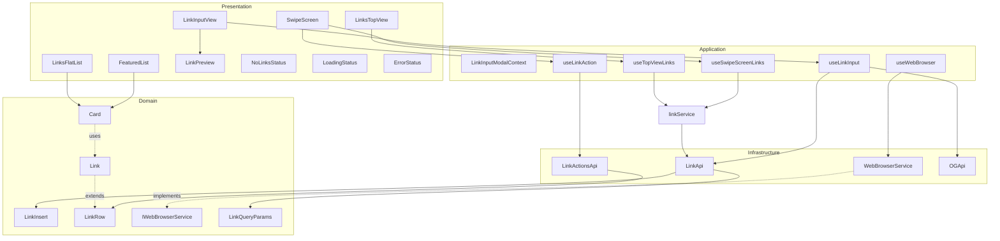
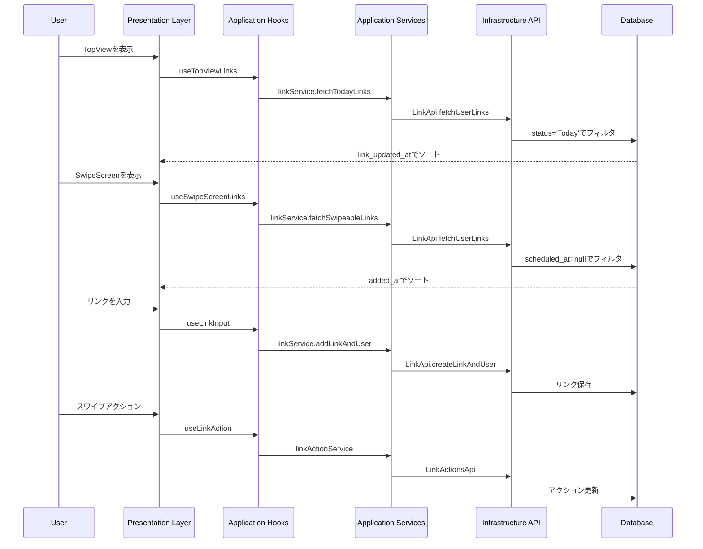

# Links Feature Architecture

This document describes the architecture of the Links feature using Mermaid
diagrams.

## Component Architecture

## Data Flow

## Architecture Overview

1. **レイヤー構造**:

   - **Presentation**: UIコンポーネント

     - LinksTopView: 今日読むリンクの表示
     - SwipeScreen: リンクのスワイプ操作
     - 共通コンポーネント（LoadingStatus, ErrorStatus, NoLinksStatus）

   - **Application**: ビジネスロジック

     - Hooks:
       - useTopViewLinks: Today状態のリンク取得
       - useSwipeScreenLinks: スワイプ可能なリンク取得
     - Services:
       - linkService: リンク操作の中心的なロジック
       - フィルタリングとソート処理

   - **Domain**: モデルと型定義

     - Link: 基本的なリンクモデル
     - LinkQueryParams: クエリパラメータの型定義
     - LinkActionStatus: リンクの状態定義

   - **Infrastructure**: 外部サービス連携
     - LinkApi: Supabaseとの通信
     - シンプルで再利用可能なクエリ機能

2. **主要な機能フロー**:

   - **TopView表示**

     - Todayステータスのリンク取得
     - link_updated_atによる並び替え
     - エラー状態と空の状態のハンドリング

   - **SwipeScreen表示**
     - scheduled_atが空のリンク取得
     - added_atによる古い順での並び替え
     - スワイプ操作による状態更新

3. **データの流れ**:

   - **取得フロー**:

     1. UI層: フック呼び出し
     2. Application層: ビジネスロジック適用
     3. Infrastructure層: データベースクエリ実行
     4. 結果を上位層に伝播

   - **更新フロー**:
     1. UI層: アクション発生
     2. Application層: 状態更新ロジック
     3. Infrastructure層: データベース更新
     4. UI層: 状態反映

4. **エラーハンドリング**:

   - 各層での適切なエラー捕捉
   - UIでのエラー表示
   - 空の状態の適切な処理

5. **パフォーマンス最適化**:

   - SWRによるキャッシュ
   - 効率的なクエリ実行
   - 必要なデータのみの取得

6. **拡張性**:
   - 新しいフィルタリング条件の追加が容易
   - ソート条件の変更が容易
   - 新しい表示方法の追加が容易
