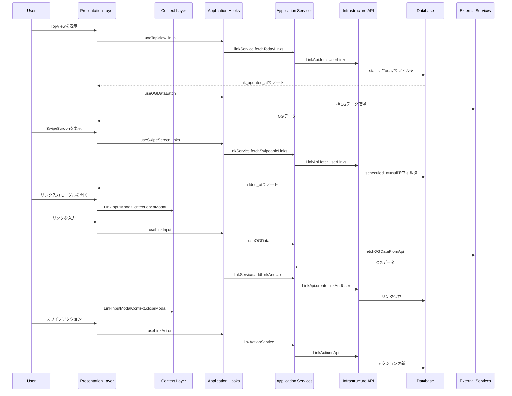

# Links Feature Architecture

This document describes the architecture of the Links feature using Mermaid
diagrams.

## Component Architecture

```mermaid
graph TD
    %% Layers
    subgraph Presentation
        LinkInputView
        SwipeScreen
        LinksTopView

        subgraph Components
            subgraph Lists
                LinksFlatList
                FeaturedLinksList
            end

            subgraph Cards
                HorizontalCard
                FeaturedLinksCard
                LinkInfoCard
            end

            subgraph Status
                ErrorStatus
                SwipeScreenErrorStatus
                LoadingStatus
                TopViewNoLinksStatus
            end

            subgraph Preview
                LinkPreview
            end
        end
    end

    subgraph Application
        LinkInputModalContext
        useLinkInput
        useTopViewLinks
        useSwipeScreenLinks
        useWebBrowser
        useLinkAction
        useOGData
        useOGDataBatch
        cardService
        linkActionService
    end

    subgraph Domain
        Card
        Link
        LinkInsert
        LinkRow
        OGData
        IWebBrowserService
        LinkQueryParams
        UserLink
        BaseUserLinkActions
    end

    subgraph Infrastructure
        WebBrowserService
        LinkActionsApi
        LinkApi
        OGApi
        fetchOGDataFromApi
    end

    %% Relationships
    LinkInputView --> LinkInputModalContext
    LinkInputView --> useLinkInput
    LinkInputView --> LinkPreview
    LinkPreview --> LinkInfoCard
    LinkPreview --> LoadingStatus
    SwipeScreen --> useSwipeScreenLinks
    SwipeScreen --> useLinkAction
    SwipeScreen --> SwipeScreenErrorStatus
    LinksTopView --> useTopViewLinks
    LinksTopView --> useOGDataBatch
    LinksTopView --> ErrorStatus
    LinksFlatList --> HorizontalCard
    FeaturedLinksList --> FeaturedLinksCard

    useTopViewLinks --> linkService
    useSwipeScreenLinks --> linkService
    linkService --> LinkApi
    useLinkInput --> LinkApi
    useLinkInput --> useOGData
    useOGData --> OGApi
    useOGDataBatch --> OGApi
    useOGData --> fetchOGDataFromApi
    useLinkAction --> linkActionService
    linkActionService --> LinkActionsApi
    useWebBrowser --> WebBrowserService

    WebBrowserService -.implements.-> IWebBrowserService
    Link -.extends.-> LinkRow
    Card -.uses.-> Link
    Card -.uses.-> OGData
    UserLink -.uses.-> BaseUserLinkActions

    %% Services
    LinkApi --> LinkQueryParams
    LinkApi --> LinkInsert
    LinkActionsApi --> LinkRow
    OGApi --> OGData
```



## Data Flow



## Architecture Overview

1. **レイヤー構造**:

   - **Presentation**: UIコンポーネント

     - Views:
       - LinksTopView: 今日読むリンクの表示
       - SwipeScreen: リンクのスワイプ操作
       - LinkInputView: リンク入力モーダル
     - Components:
       - Lists:
         - FeaturedLinksList: 注目リンクの表示
         - LinksFlatList: 通常リンクのリスト表示
       - Cards:
         - FeaturedLinksCard: 注目リンクカード
         - HorizontalCard: 通常リンクカード
         - LinkInfoCard: リンク情報表示
       - Status:
         - ErrorStatus: 汎用エラー表示
         - SwipeScreenErrorStatus: スワイプ画面用エラー表示
         - LoadingStatus: ローディング表示
         - TopViewNoLinksStatus: 空状態表示
       - Preview:
         - LinkPreview: リンクプレビュー表示

   - **Context**: 状態管理

     - LinkInputModalContext: モーダル表示状態の管理

   - **Application**: ビジネスロジック

     - Hooks:
       - useTopViewLinks: Today状態のリンク取得
       - useSwipeScreenLinks: スワイプ可能なリンク取得
       - useLinkInput: リンク入力とOGデータ取得
       - useOGData: 個別OGデータのキャッシュと取得
       - useOGDataBatch: 複数リンクのOGデータ一括取得
     - Services:
       - linkService: リンク操作の中心的なロジック
       - linkActionService: リンクアクション管理
       - cardService: カード表示用のデータ加工

   - **Domain**: モデルと型定義

     - Link: 基本的なリンクモデル
     - UserLink: ユーザーリンク情報
     - BaseUserLinkActions: リンクアクション基本型
     - OGData: OGデータの型定義
     - LinkQueryParams: クエリパラメータの型定義

   - **Infrastructure**: 外部サービス連携
     - LinkApi: Supabaseとの通信
     - LinkActionsApi: アクション関連のAPI
     - OGApi: OGデータ取得
     - WebBrowserService: ブラウザ制御

2. **主要な機能フロー**:

   - **TopView表示**

     - Todayステータスのリンク取得
     - 一括OGデータ取得による最適化
     - Featured/通常リンクの分離表示

   - **リンク入力とプレビュー**

     - モーダル管理による UI/UX 改善
     - URLのバリデーション
     - リアルタイムOGデータプレビュー

   - **SwipeScreen表示**
     - 効率的なリンクフィルタリング
     - スワイプアクションの最適化

3. **データの流れ**:

   - **取得フロー**:

     1. Context層: 状態管理
     2. UI層: フック呼び出し
     3. Application層: ビジネスロジック適用
     4. Infrastructure層: データベースクエリ実行

   - **更新フロー**:
     1. Context層: モーダル状態更新
     2. UI層: アクション発生
     3. Application層: 状態更新ロジック
     4. Infrastructure層: データベース更新

4. **エラーハンドリング**:

   - URLバリデーション
   - OGデータ取得エラー
   - 各層での適切なエラー捕捉
   - UIでのエラー表示の改善
   - 空の状態の適切な処理

5. **パフォーマンス最適化**:

   - SWRによるキャッシュ
   - OGデータの一括取得
   - モーダル状態の最適化
   - 効率的なクエリ実行

6. **拡張性**:
   - コンテキストベースの状態管理
   - フック単位での機能拡張
   - 表示コンポーネントの独立性
   - データ取得の最適化オプション

## Testing Strategy

1. **テスト構造**:

   ```
   feature/links/
   ├── __tests__/
   │   ├── presentation/
   │   │   ├── components/
   │   │   │   ├── lists/
   │   │   │   │   ├── FeaturedLinksList.test.tsx
   │   │   │   │   └── LinksFlatList.test.tsx
   │   │   │   ├── cards/
   │   │   │   │   ├── FeaturedLinksCard.test.tsx
   │   │   │   │   ├── HorizontalCard.test.tsx
   │   │   │   │   └── LinkInfoCard.test.tsx
   │   │   │   ├── status/
   │   │   │   │   ├── ErrorStatus.test.tsx
   │   │   │   │   ├── SwipeScreenErrorStatus.test.tsx
   │   │   │   │   └── LoadingStatus.test.tsx
   │   │   │   └── preview/
   │   │   │       └── LinkPreview.test.tsx
   │   │   └── views/
   │   │       ├── LinksTopView.test.tsx
   │   │       ├── SwipeScreen.test.tsx
   │   │       └── LinkInputView.test.tsx
   │   ├── application/
   │   │   ├── hooks/
   │   │   │   ├── useOGDataBatch.test.ts
   │   │   │   ├── useLinkInput.test.ts
   │   │   │   └── useTopViewLinks.test.ts
   │   │   ├── context/
   │   │   │   └── LinkInputModalContext.test.tsx
   │   │   └── service/
   │   │       ├── linkService.test.ts
   │   │       └── linkActionService.test.ts
   │   └── infrastructure/
   │       └── api/
   │           ├── linkApi.test.ts
   │           └── linkActionsApi.test.ts
   ```

2. **テスト種別**:

   - **単体テスト**

     - コンポーネントの表示状態
       - 各種ステータス表示の検証
       - エラーメッセージの表示
       - ローディング状態の表示
     - フックのロジック
     - サービスのメソッド
     - APIの呼び出し

   - **統合テスト**

     - TopViewの表示フロー
     - リンク入力からプレビュー
     - スワイプアクションフロー

   - **E2Eテスト**
     - ユーザーシナリオ
     - エラーハンドリング
     - パフォーマンス

3. **テスト優先度**:

   - **High**

     - リンク入力バリデーション
     - OGデータ取得
     - スワイプアクション
     - エラー表示

   - **Medium**

     - UI表示の整合性
     - データ更新の反映
     - キャッシュの動作

   - **Low**
     - エッジケース
     - 特殊な入力値
     - 極端な負荷状態

4. **テストカバレッジ目標**:

   - **Presentation**: 80%
   - **Application**: 90%
   - **Infrastructure**: 85%
   - **全体**: 85%以上

5. **テスト環境**:

   - Jest + React Testing Library
   - MSW（APIモック）
   - Storybook（UIテスト）
   - Cypress（E2Eテスト）

6. **テスト実装方針**:

   - **コンポーネントテスト**

     - スナップショットテスト
     - インタラクションテスト
     - プロップスバリデーション

   - **フックテスト**

     - 状態変更の検証
     - エラーハンドリング
     - 非同期処理

   - **サービステスト**

     - メソッドの入出力
     - エラー条件
     - 境界値テスト

   - **APIテスト**
     - リクエスト形式
     - レスポンス処理
     - エラーケース
