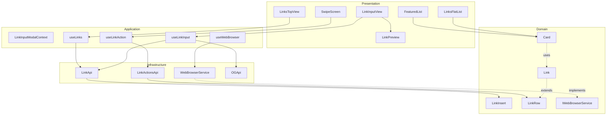
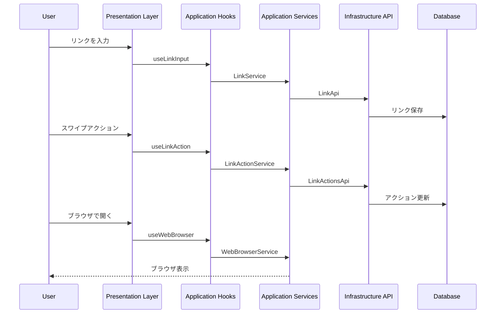

# Links Feature Architecture

This document describes the architecture of the Links feature using Mermaid
diagrams.

## Component Architecture

## Data Flow

## Architecture Overview

1. **レイヤー構造**:

   - Presentation: UIコンポーネント（View, Screen, Components）
   - Application: ビジネスロジック（Hooks, Services）
   - Domain: ドメインモデルと型定義
   - Infrastructure: 外部サービスとの連携（API）

2. **主要な機能フロー**:

   - リンク入力と保存
   - リンクのスワイプアクション
   - ブラウザでのリンク表示
   - OGデータの取得と表示

3. **データの流れ**:
   - ユーザーアクション → Hooks → Services → API → データベース
   - データベース → API → Services → Hooks → UI表示
