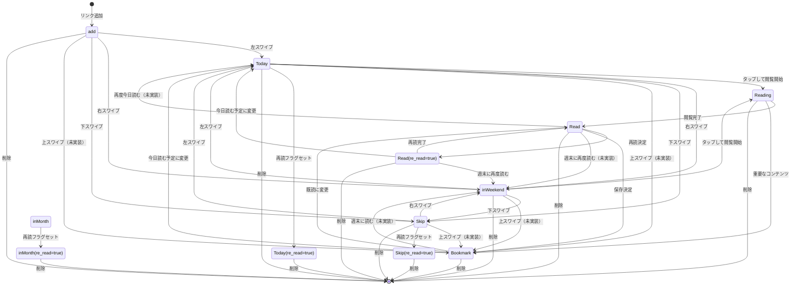

# リンクステータスと遷移条件

このドキュメントでは、Linpe アプリケーションにおけるリンクのステータスと、それらの間の遷移条件について説明します。Linpeは世の中に溢れるリンクを気軽に優先度管理することを目的としています。

## 優先度管理の概念

Linpeのリンク管理システムの中核は「優先度管理」です：

1. **リンクの収集**: ユーザーが見つけたリンクを簡単に追加(`add`)
2. **優先度の振り分け**: スワイプ操作で今読むべきもの(`Today`)、時間がある時に読むもの(`inWeekend`)、後回しにするもの(`Skip`)に分類
3. **読書状態の管理**: リンクの読書状態を追跡(`Reading`, `Read`,
   `Bookmark`)と再読フラグによる状態管理

この仕組みにより、情報過多時代におけるリンクの効率的な整理と消費が可能になります。

## リンクステータスの概要

リンクは以下の7つの基本ステータスを持ちます：

| ステータス  | 説明                                                                 | 優先度/状態  |
| ----------- | -------------------------------------------------------------------- | ------------ |
| `add`       | 新しく追加されたリンク。初期状態。                                   | 未分類       |
| `Today`     | 今日読む予定のリンク。優先度が高い。                                 | 高優先度     |
| `inWeekend` | 週末に読む予定のリンク。まとまった時間があるときに読む。             | 中優先度     |
| `Reading`   | 現在読んでいるリンク。読了時間は記録されない。                       | 読書状態     |
| `Read`      | 読了したリンク。読了時間が記録される。                               | 完了状態     |
| `Bookmark`  | ブックマークされたリンク。いつでも参照できるよう保存されている。     | 永続保存状態 |
| `Skip`      | スキップされたリンク。あまり重要でないか、後で改めて検討するリンク。 | 低優先度     |

**重要**:
UIには「Re-Read」ステータスも表示されますが、これはDBには保存されておらず、他のステータス（Skip、Today、inMonth、Read）と`re_read=true`フラグの組み合わせとして表現されます。

## Re-Readの扱い

Re-Readは特別なケースとして扱われます：

1. **UI表示**: ユーザーインターフェースでは「Re-Read」として表示
2. **データ保存**: 内部的には以下の条件で判定
   - `re_read=true` かつ
   - ステータスが `Skip`, `Today`, `inMonth`, `Read` のいずれか
3. **フィルタリング**:
   `Re-Read`ステータスでフィルタリングする場合、内部的には上記の条件を組み合わせて検索

**注意**: 以前は「Re-Read」をステータスの一つとして扱うコードが一部に存在していましたが、現在はすべてのコードで`re_read`フラグを使った実装に統一されています。

## ステータス遷移図

以下の図は、リンクステータス間の理想的な遷移を示しています：



## 現在実装されているスワイプ操作

Linpeアプリケーションでは、スワイプ操作によるリンクステータスの変更が主要な機能です。現在の実装では以下のスワイプ操作が定義されています：

| スワイプ方向 | 遷移先ステータス | 適用可能な元ステータス      |
| ------------ | ---------------- | --------------------------- |
| 左スワイプ   | `Today`          | `add`, `inWeekend`, `Skip`  |
| 右スワイプ   | `inWeekend`      | `add`, `Today`, `Skip`      |
| 下スワイプ   | `Skip`           | `add`, `Today`, `inWeekend` |

**制限**: 上スワイプのアクションは現在定義されていません。また、`Read`,
`Reading`, `Bookmark` ステータスに対するスワイプ操作も実装されていません。

## 記録されるメタデータ

各リンクには以下のメタデータが記録され、ステータス変更時に更新されます：

| メタデータ          | 説明                       | 更新タイミング                                   |
| ------------------- | -------------------------- | ------------------------------------------------ |
| `status`            | リンクの現在のステータス   | 全てのステータス変更時                           |
| `updated_at`        | 最終更新日時               | 全てのステータス変更時                           |
| `swipe_count`       | スワイプ操作が行われた回数 | 全てのステータス変更時にインクリメント           |
| `scheduled_read_at` | 読む予定の日時             | ステータスに応じて計算                           |
| `read_at`           | 読んだ日時                 | `Read`/`Bookmark`への変更時                      |
| `read_count`        | 読んだ回数                 | リンクが読了ステータスになった回数               |
| `re_read`           | 再読フラグ                 | Re-Read設定時にtrue、他のアクションでfalseに戻す |

### ステータス別のメタデータ更新ロジック

| ステータス変更 | `scheduled_read_at`       | `read_at`    | `re_read` | 他のメタデータ更新                          |
| -------------- | ------------------------- | ------------ | --------- | ------------------------------------------- |
| → `add`        | 設定なし                  | 変更なし     | false     | `updated_at`, `swipe_count`                 |
| → `Today`      | 当日の0時0分0秒           | 変更なし     | 変更なし  | `updated_at`, `swipe_count`                 |
| → `inWeekend`  | 次の日曜日の0時0分0秒     | 変更なし     | 変更なし  | `updated_at`, `swipe_count`                 |
| → `Skip`       | `null`に設定              | 変更なし     | 変更なし  | `updated_at`, `swipe_count`                 |
| → `Reading`    | `null`に設定              | `null`に設定 | false     | `updated_at`, `swipe_count`                 |
| → `Read`       | 更新しない（`undefined`） | 現在時刻     | 変更なし  | `updated_at`, `swipe_count`, `read_count`+1 |
| → Re-Read設定  | 当日の0時0分0秒           | 変更なし     | true      | `updated_at`, `swipe_count`                 |
| → `Bookmark`   | 当日の0時0分0秒           | 現在時刻     | false     | `updated_at`, `swipe_count`, `read_count`+1 |

**注意**:
Re-Readはユーザーインターフェイスでのみ表示され、内部的にはUIで選択したステータスと`re_read=true`の組み合わせで表現されます。

## 読書状態の管理

読書状態の遷移は、主にユーザーのタップ操作によって行われます：

| 操作         | 遷移先ステータス                | メタデータの変更                                      |
| ------------ | ------------------------------- | ----------------------------------------------------- |
| 読了マーク   | `Read` (re_read=変更なし)       | `read_at` = 現在時刻, `scheduled_read_at` = undefined |
| 読書開始     | `Reading`                       | `read_at` = null, `scheduled_read_at` = null          |
| 再読マーク   | 現在のステータス (re_read=true) | re_read = true, 他のメタデータは維持                  |
| ブックマーク | `Bookmark`                      | `read_at` = 現在時刻, `scheduled_read_at` = 計算値    |

## スケジュール日時の計算

ステータスに応じて、`scheduled_read_at` は以下のように設定されます：

- `Today`: 当日の0時0分0秒
- `inWeekend`: 次の日曜日の0時0分0秒（現在が土曜日または日曜日の場合は翌週の日曜日）
- `Skip`: null
- `Read`: undefined（更新されない）
- その他のステータス: 当日の0時0分0秒

## 優先順位ベースの表示ロジック

`swipeableLinkService.ts`では、以下の優先順位でスワイプ画面にリンクが表示されます：

1. **最優先（Priority 1）**：ステータスが`add`のリンク
2. **次優先（Priority
   2）**：ステータスが`Today`または`inWeekend`で、読む予定日が過去のリンク（ただし今日の日付は除く）
3. **第三優先（Priority 3）**：以下のいずれかの条件を満たすリンク
   - ステータスが`Skip`のリンク
   - `re_read=true`フラグが設定されているリンク（ステータスに関わらず、`Read`ステータスも含む）

表示されないステータス：`re_read=false`かつ`Read`ステータスのリンク、`Reading`ステータス、`Bookmark`ステータス

これにより、ユーザーは以下のような順序でリンクを処理することができます：

1. 新しく追加されたリンク（`add`）を最初に処理
2. 過去に読む予定だったが処理されなかったリンク（過去の`Today`または`inWeekend`）を次に処理
3. 後回しにしたリンク（`Skip`）や再読マークが付いたリンク（`re_read=true`）を最後に処理

## ユーザーインターフェースとデータモデルの違い

Linpeアプリケーションでは、ユーザーインターフェース（UI）とデータモデルの間に次のような違いがあります：

1. **Re-Readステータス**:

   - **UI表示**: ユーザーには「Re-Read」ステータスとして表示されます。
   - **データモデル**: 内部的には各ステータス（Skip, Today, inMonth, Read）と
     `re_read=true` の組み合わせで表現されます。

2. **ステータス変更の処理**:
   - **UI操作**: ユーザーが「Re-Read」を選択した場合
   - **実装処理**: `linkActionService.updateLinkActionByReadStatus`
     は内部で元のステータスを維持し、`re_read=true` に設定します。

## 現在の実装における抜け漏れと課題

現在の実装では、以下の具体的な抜け漏れや課題があります：

1. **スワイプ操作の不足**:

   - **上スワイプのアクション未定義**:
     4方向スワイプの潜在能力を活かしきれていない
   - **読書関連ステータスへのスワイプ遷移なし**: `Read`, `Reading`,
     `Bookmark`へのスワイプ操作がない

2. **ステータス遷移の不整合**:

   - **`Bookmark`からの遷移制限**: `Bookmark`から`inWeekend`への直接遷移がない
   - **`Read`からの優先度再設定**: 読了後に再度優先度を設定する遷移パスが不完全

3. **自動化機能の不足**:

   - **`Reading`→`Read`の自動遷移なし**: 読書完了を自動検出する仕組みがない
   - **古いリンクの自動昇格なし**: 長期間`add`や`inWeekend`状態のままのリンクを処理する仕組みがない

4. **メタデータ活用の制限**:

   - **`swipe_count`の未活用**: スワイプ回数は記録されているが、この情報を活用する機能がない
   - **`read_count`の制限的利用**: 読了回数に基づく推奨やフィルタリング機能がない
   - **`re_read`フラグの潜在的活用**: 再読フラグを使った特別な表示やフィルタリング機能の拡張性

5. **一括操作の欠如**:

   - **バッチ処理機能なし**: 複数リンクの一括ステータス変更機能がない
   - **ドメイン別/日付別の一括処理**: 特定条件での一括操作機能がない

6. **メタデータの更新ロジックの問題**:
   - **`read_at`の不整合**:
     `Reading`ステータスから他のステータスに遷移する際の`read_at`の扱いに一貫性がない
   - **`scheduled_read_at`の冗長な更新**: 読了状態で予定日を設定する必要がない場合でも計算が行われる
   - **読書時間の記録なし**: 実際の読書時間（開始から終了までの経過時間）が記録されない

## 具体的な改善提案

1. **スワイプ操作の完全実装**:

   ```typescript
   // swipe.ts
   export const OVERLAY_BACKGROUND_COLORS = {
     left: "rgba(40, 44, 52, 0.15)", // Today
     right: "rgba(59, 130, 246, 0.15)", // inWeekend
     top: "rgba(243, 183, 0, 0.15)", // Bookmark
     bottom: "rgba(220, 38, 38, 0.15)", // Skip
   };

   export const SWIPE_ACTIONS = {
     left: "Today",
     right: "inWeekend",
     top: "Bookmark",
     bottom: "Skip",
   };
   ```

2. **全ステータスへの一貫したスワイプ操作**:

   ```typescript
   // linkActionService.ts
   async updateLinkActionBySwipeForAllStatuses(
     userId: string,
     linkId: string,
     direction: "left" | "right" | "top" | "bottom",
     currentStatus: LinkActionStatus,
     swipeCount: number,
   ): Promise<UpdateLinkActionResponse> {
     const actionMapping = {
       left: "Today",
       right: "inWeekend",
       top: "Bookmark",
       bottom: "Skip",
     };

     // 現在のステータスにかかわらず一貫した遷移を提供
     return await this.updateLinkAction(
       userId,
       linkId,
       actionMapping[direction] as LinkActionStatus,
       swipeCount
     );
   }
   ```

3. **読書状態の自動遷移機能とメタデータ最適化**:

   ```typescript
   // 閲覧時間の追跡と自動遷移のコンセプト
   async trackReadingTimeAndAutoTransition(
     userId: string,
     linkId: string,
     readingStartTime: Date,
     currentStatus: LinkActionStatus,
     swipeCount: number,
   ): Promise<void> {
     const now = new Date();
     const readingDuration = (now.getTime() - readingStartTime.getTime()) / 1000; // 秒単位
     const AUTO_READ_THRESHOLD = 120; // 2分以上読んだら自動的に既読に

     if (readingDuration >= AUTO_READ_THRESHOLD && currentStatus === "Reading") {
       // 読了時間を明示的に記録
       await this.updateLinkActionWithMetadata(
         userId,
         linkId,
         "Read",
         swipeCount,
         {
           read_at: now.toISOString(),
           reading_duration: readingDuration,
           read_count_increment: true, // read_countを明示的にインクリメント
           re_read: false // 通常読了の場合はfalse
         }
       );
     }
   }
   ```

4. **メタデータの拡張と活用**:

   ```typescript
   // メタデータ拡張のためのインターフェース
   interface LinkMetadata {
     reading_duration?: number;        // 読書時間（秒）
     read_count_increment?: boolean;   // read_countをインクリメントするか
     last_position?: number;           // 最後に読んでいた位置（%）
     tags?: string[];                  // ユーザー定義タグ
     user_rating?: number;             // ユーザー評価（1-5）
     re_read?: boolean;                // 再読フラグ
   }

   // 再読ステータスに基づく特別な処理の例
   highlightReReadLinks(links: UserLink[]): UserLink[] {
     return links.map(link => ({
       ...link,
       importance: link.re_read ? link.importance * 1.5 : link.importance, // 再読されたリンクは重要度を高く評価
       ui_class: link.re_read ? 'highlight-reread' : '',
     }));
   }
   ```

5. **バッチ操作機能とメタデータの一括処理**:

   ```typescript
   // 複数リンクの一括処理のコンセプト
   async batchUpdateLinkStatus(
     userId: string,
     linkIds: string[],
     targetStatus: LinkActionStatus,
     additionalMetadata?: LinkMetadata,
   ): Promise<{
     success: boolean;
     successCount: number;
     failedCount: number;
   }> {
     let successCount = 0;
     let failedCount = 0;

     for (const linkId of linkIds) {
       try {
         await this.updateLinkActionWithMetadata(
           userId,
           linkId,
           targetStatus,
           0, // スワイプカウントは変更しない
           additionalMetadata
         );
         successCount++;
       } catch (error) {
         failedCount++;
         console.error(`Failed to update link ${linkId}:`, error);
       }
     }

     return {
       success: failedCount === 0,
       successCount,
       failedCount,
     };
   }
   ```

6. **メタデータ更新の最適化**:

   ```typescript
   // より細かなメタデータ制御が可能なメソッド
   async updateLinkActionWithMetadata(
     userId: string,
     linkId: string,
     status: LinkActionStatus,
     swipeCount: number,
     metadata?: {
       scheduled_read_at?: string | null;
       read_at?: string | null;
       reading_duration?: number;
       read_count_increment?: boolean;
       re_read?: boolean;
       additional_data?: Record<string, unknown>;
     }
   ): Promise<UpdateLinkActionResponse> {
     // ステータスに応じたデフォルトメタデータの設定
     const defaultMetadata = this._getDefaultMetadataForStatus(status);

     // ユーザー指定メタデータとマージ
     const finalMetadata = { ...defaultMetadata, ...(metadata || {}) };

     // API呼び出し
     // ...
   }

   // ステータスごとの適切なデフォルトメタデータを返す
   private _getDefaultMetadataForStatus(status: LinkActionStatus): {
     scheduled_read_at?: string | null;
     read_at?: string | null;
     re_read?: boolean;
   } {
     switch (status) {
       case "Read":
         return {
           scheduled_read_at: undefined, // 更新しない
           read_at: new Date().toISOString(),
           re_read: false // デフォルトはfalse
         };
       case "Reading":
         return {
           scheduled_read_at: null,
           read_at: null,
           re_read: false
         };
       case "Skip":
         return {
           scheduled_read_at: null,
           re_read: false
           // read_atは更新しない
         };
       // その他のケース
       // ...
     }
   }
   ```

## シンプルさと直感性の維持

改善を行う際には、アプリケーションの核となる「シンプルさ」と「直感性」を維持することが重要です：

1. **4方向スワイプで基本操作を完結**: 最も頻繁に使う操作はスワイプで直感的に行えるようにする
2. **ステータス名の直感性**: ステータス名が意味するものを直感的に理解できるようにする
3. **自然な遷移フロー**: リンクのライフサイクルが自然に流れるようにステータス遷移を設計する
4. **メタデータ更新の自動化**: ユーザーに意識させることなく適切なメタデータが記録されるようにする
5. **内部実装とUIの分離**: データモデルの変更（例：Re-Readの実装方法）がUIに影響しないようにする

## 参照

- [Domain Models](../domain/models/types/links.ts)
- [Link Action Service](../application/service/linkActionService.ts)
- [Use Link Action Hook](../application/hooks/link/useLinkAction.ts)
- [Swipeable Link Service](../application/service/swipeableLinkService.ts)
- [Scheduled Date Utils](../infrastructure/utils/scheduledDateUtils.ts)
- [Link Actions API](../infrastructure/api/linkActionsApi.ts)
